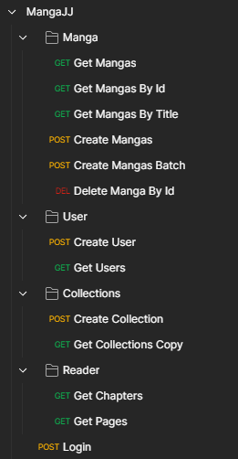

## MangaJJ - API

<p align="center">
    
    <br />
    <br />
    <a href="https://mangajj.herokuapp.com/manga?limit=10&page=0&title=Naruto">Demo</a>
    ·
    <a href="https://github.com/jjeanjacques10/mangajj/issues">Report Bug</a>
    ·
    <a href="https://github.com/jjeanjacques10/mangajj/issues">Request Feature</a>
</p>

<p align="center">
   <a href="https://www.linkedin.com/in/jjean-jacques10/">
      
   </a>
  

  <a href="https://github.com/jjeanjacques10/mangajj/commits/master">
    
  </a>
  
  
  <a href="https://github.com/jjeanjacques10/mangajj/stargazers">
    
  </a>
</p>

It's a project to read manga online and control your manga collection. It's is possible to search for manga, add it to your collection.

## Steps

- [x] Integrate with some API
  - Lazy load process
- [x] Create a job to update my database
- [x] User Control
- [x] Add authentication
- [x] Pagination
- [x] Swagger
- [x] Deploy
  - [x] Heroku
- [x] Read manga pages
- [ ] Spring Controller Advice

## Technology

- [Java Spring Boot](https://spring.io/projects/spring-boot)
- [Hibernate](https://hibernate.org/)
- [MySQL](https://www.mysql.com/)
- [H2 Database](https://www.h2database.com/html/main.html)
- [Docker](https://www.docker.com/)
- [JUnit](https://junit.org/junit5/)

### Config Database

Access the file **[application.properties](src/main/resources/application.yml)**

```
spring.datasource.username={username}
spring.datasource.password={password}
```

### Integrations

Using external API to populate database: <https://github.com/jikan-me/jikan>.

Using service [MangaBit](https://github.com/franproque/MangaBit) to scrap chapter pages.

### Config Local

- VM Options

```
-Dspring.profiles.active=local
```

- Enviroment - Using H2 Database

```
DRIVER_DB=org.h2.Driver;
LOGGING_LEVEL_ROOT=info;
PASSWORD_DB=;
URL_DB=jdbc:h2:mem:AZ\;DB_CLOSE_DELAY\=-1\;DB_CLOSE_ON_EXIT\=FALSE;
USER_DB=sa
```

### Submodules

To clone this project with submodules, use the following command:

``` bash
git clone --recurse-submodules
```

### Postman

Access postman collection **[here](./files/Manga%20JJ.postman_collection.json)**



### Documentation Swagger

Access Swagger UI

- [http://localhost:8080/swagger-ui/index.html](http://localhost:8080/swagger-ui/index.html)
- [https://mangajj.herokuapp.com/swagger-ui/index.html](https://mangajj.herokuapp.com/swagger-ui/index.html)

> Heroku is not more free, so the application is not available anymore.

---
Developed by [Jean Jacques Barros](https://github.com/jjeanjacques10)
